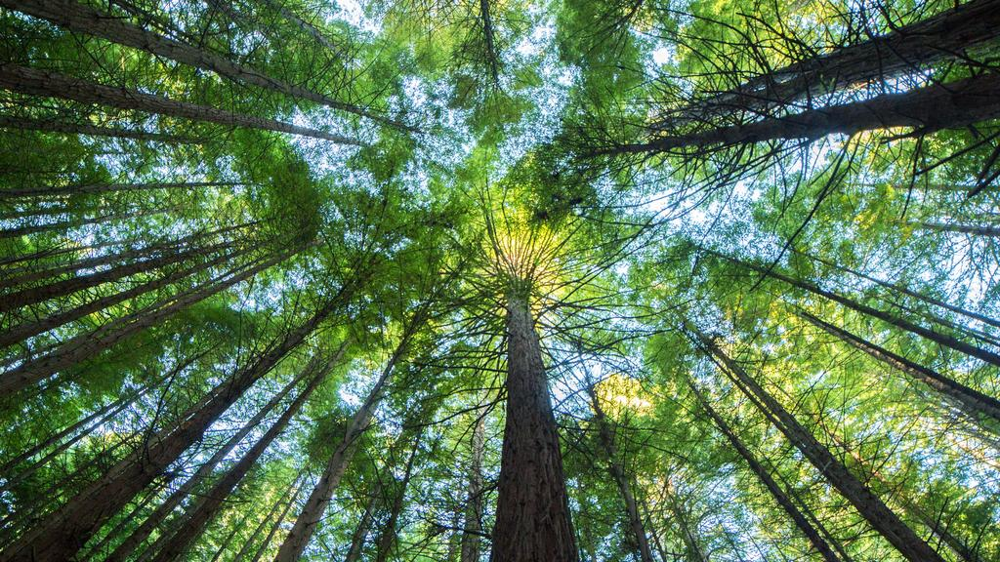

```{r setup, include=FALSE}
knitr::opts_chunk$set(echo = FALSE)
```

# Article analysis 2 

## Title of the article 

SNH to plant 20,000 trees at first National Nature Reserve

## Name of the magazine and source

The national, https://www.thenational.scot/news/17948655.snh-plant-20-000-trees-first-national-nature-reserve/

## Vocabulary 

| Words from the text | Synonym/explanation in English |
| ------------------- | ------------------------------ |
| To feature    | To have                   |
| Remnants      | Rests
| The aim       | The goal |
| Further       | More |
| To enhance    | To boost |
| Broadleaf     | Large leaves of trees |
| Towards       | In relation to |
| 

## Analysis table 

|                              |                                                                     |
| ---------------------------- | ------------------------------------------------------------------- |
| Researchers                  | Stuart Macquarrie, the leader of natural reserves of the SNH                       |
| Published in?                | 10-05-2019                                                       |
| General topic?               | The article talk about the plantation of 20,000 trees in a natural reserve in UK and the consequences.                     |
| Procedure/what was examined? | 20,000 trees will be planted in the first reserve naturelle in UK next year. It's the continuity of regeneration efforts. Scottish Natural Heritage will extend this programm at Beinn Eighe, a natural reserve. There is a rest of ancient Caledonian pine who has planted 800,00 differents trees. SNH promotes the natural regeneration with the expansion of forests. The forests capture 30,000 tonnes of greenhouse gases par years. Stuart Macquarrie says that the plantation of trees will allow the fight against climate change, enhance the biodiversity of natural reserves and restore ecosystem habitats. The forest expanson is crucial to limit the climate change.  |
| Conclusions/discovery?       | The leader of the natural reserves said that the plantation of 20,000 trees will have a positive consequence on the biodiversity.      |
| Remaining questions?         | We don't know if the plantation of 20,000 trees will be positive on the biodiversity and the conservation of the natural reserve. |


