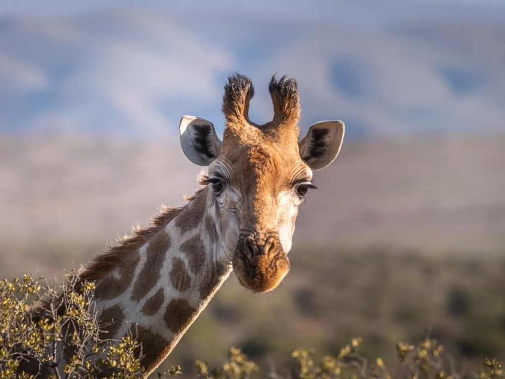

```{r setup, include=FALSE}
knitr::opts_chunk$set(echo = FALSE)
```

# Article analysis 3

## Title of the article

UWA re-introduces giraffes to Pian Upe Wildlife reserve

## Name of the magazine and source  

The independent, https://www.independent.co.ug/uwa-re-introduces-giraffes-to-pian-upe-wildlife-reserve/

## Vocabulary 

|                     |                                |
| ------------------- | ------------------------------ |
| Further   | Also                   |
| Crafts  | Artistry     |
| On behalft of | In the nalme of |
| A bid | An offer |
| To enable   | To permit  |
| Dwindling        | Decreasing   |
| A hartebeet | Either of two large African antelopes |
| Neighbouring | Connecting |

## Analysis table 

|                              |                                                                     |
| ---------------------------- | ------------------------------------------------------------------- |
| Researchers                  | Dr. Panta Kasoma. He is director of the Jane Goodall Institute.                        |
| Published in?                | Oct 29, 2019                                                       |
| General topic?               |  The article is about the re-introduction of giraffes in a natural reserve and the advantage thaht it will have on the resvere and on the biodiversity.                     |
| Procedure/what was examined? | The Uganda Wildlife Authority will reintroduced 5 giraffes Rothschild in the reserve of Pian Upe. It's a part of a reintrudction program. A total of 15 giraffes will be reintroduced (5 males and 10 females). The reserve is the bigger reserve protected in Uganda. It is 2043 square km. Dr. Panta Kasoma, the director of the Jane Goodall Institute, said that the reintroduction of the giraffes is a part of a program to reintroduce and manage endangered species. It could increase the reserve tourism. It could have other positive consequences on craft, employment and other economic consequences. The last year, 92 impalas were reintroducted and it had a positive consequence on the reserve tourism. The populations with a strong attachment to the species could help for the conservation of the species and the of the increase tourism to improve biodiversity and ecosystems. The transfer of animals is supported by different organisms such as the Giraffe Conservation Foundation and the Uganda Wildlife Conservation Education Centre.
| Conclusions/discovery?       |  The reintroduction of giraffes will improve the long-term survival of the species. It will restore natural biodiversity and the long-term. It will also have positives consequences on the economy.     |
| Remaining questions?         | / | 




