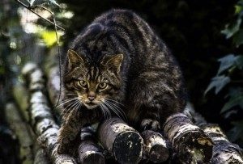

```{r setup, include=FALSE}
knitr::opts_chunk$set(echo = FALSE)
```

# Article analysis 4

## Title of the article 

Reintroduction centre plan for endangered Scottish wildcats

## Name of the magazine and source 

The Herald, https://www.heraldscotland.com/news/18045704.reintroduction-centre-plan-endangered-scottish-wildcats/


## Vocabulary 

|                     |                                |
| ------------------- | ------------------------------ |
| A lifeline   |  Something regarded as indispensable for the maintaining or protection of life                  |
| High                    | Elevated         |
| Feral       | Undomesticated   |
| Threat   | Menace  |
| Breeding   | The sexual propagation of plants or animals  |
| The brink  | The border  |
| Tremendously  | Gigantic  |
| Sustainable  | Continue  |
| Ownership  | Proprietary  |
| Neutering  | To castrate   |
## Analysis table 

|                              |                                                                     |
| ---------------------------- | ------------------------------------------------------------------- |
| Researchers                  | Roseanna Cunningham is a Scottish politician who is the Cabinet Secretary for Environment, Climate Change and Land Reform. Helen Senn manages the RZSS Conservation department. Martin Gaywood is the SNH Species Projects Managers.                       |
| Published in?                | Nov 19, 2019  |
| General topic?               | The article is about the reintroduction of a species on the brink of exctinction : the wildcat.                      |
| Procedure/what was examined? | The wildcats are on the brink of extinction. So, a centre for the reintroductin will open. It's "The wildcay reintroduction centre". It is financed by European funds. The centre won't be open to the public and it will have veterinary care, remote monitoring and training. The liberation of cats will take place into Cairngorms National Park in 2022. The park is located in the northeast Scotland. The project is supporting by a £3.2 million Eu Life grant and a co-funding from the Garfield Western Foundation and other associations. The main threat of wilds cats is the hybridization with domestic cats that is why Martin Gaywood, the SNH Species Projects Managers, said that it is important to decrease the phenomenon. So, the population must sterilize and vaccinate domestic cats. Helen Senn, manager of the RZSS Conservation department, said that it's not to late but it's really time to do something. To stimulate the genetic heritage of wild cats, we must using wild cats from the existing captive population and the other wild cats from Europe. Finally, Roseanna Cunningham, a Scottish politician who is the Cabinet Secretary for Environment, Climate Change and Land Reform, think that the protection of the emblematic species is a challenge but it is possible with the help of great scientists. |
| Conclusions/discovery?       |  In closing, the reintroduction of the wildcats is a big challenge. It's important to be fast to save the species.      |
| Remaining questions?         | / |


