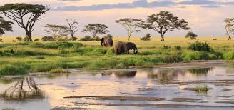

```{r setup, include=FALSE}
knitr::opts_chunk$set(echo = FALSE)
```


# Article analysis 5

## Title of the article 

Tanzanian president disapproves annulment of more protected areas.

## Name of the magazine and source 

News Ghana, https://newsghana.com.gh/tanzanian-president-disapproves-annulment-of-more-protected-areas/ 

## Vocabulary 

|                     |                                |
| ------------------- | ------------------------------ |
| Settlements   | Community                  |
| Livestock     | Farm animals       |
| Broadcast   | Transmission  |
| The required  | Necessitated  |
| Currency    | A system of money in general use in a particular country.
| A banner   | A flag   |
| To endorse   | To approve   |
## Analysis table 

|                              |                                                               |
| ---------------------------- | ------------------------------------------------------------- |
| Researchers                  | John Joseph Pombe Magufuli is a Tanzanian politician and the President of Tanzania                      |
| Published in?                | Oct. 9, 2019                                                 |
| General topic?               | The president of Tanzania took a decision about the natural reserves in Tanzania.                      |
| Procedure/what was examined? | In September, the President of Tanzania approves the annulement of protected areas and reserves for wild life to allocated to the local population. It's more that 700.000.000 hectares of protected areas that were allocated for farming, livestock and others thinks. This decision was approved in January. However, a few days ago, a banner asked to him to annul a protected area in Rukwa region. Then, he made the decision to not annulled more protected areas for the allocations of villages. He said thah the annulment of all protected reserves will destroye the habitats of fauna and flora. Also, it will stop the tourism and therefore subsidies from it.   |
| Conclusions/discovery?       |  The president of Tanzania takes measures to conserve wild fauna and flora      |
| Remaining questions?         | Maybe, it will create conflits with local population who believed they could benefit of these lands. |


