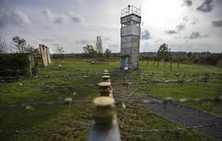

```{r setup, include=FALSE}
knitr::opts_chunk$set(echo = FALSE)
```

# Article analysis 6

## Title of the article

5 years after turning disused military bases into nature reserves, wolves return and use  bases as havens

## Name of the magazine and source 

Good News Network, https://www.goodnewsnetwork.org/germany-turns-military-bases-into-nature-reserves/

## Vocabulary 

|      |      |
| ------------------- | ------------------------------ |
| Disused | Abandoned                  |
| Purpose                  | Goal        |
| To be fortunate   | To be lucky   |
| Standoff   |  Battle   |
| Dreary    | Sad   |
| Lack    | Absence   |
| The middle-spotted woodpecker   | It is a European woodpecker  | 
| Remains  |  Residues |
| Shattered   | Devasted   |
| Dart   | Missile  |
| Litter   |The group of offspring produced at one birth by a mammal. |
| Poaching  | The illegal hunting or capturing of wild animals  |
| Nonprofit | Not established for the purpose of making a profit  |
| Backdone   | Foundation  |
| To halt  | To stop  |

## Analysis table 

|                              |                                                                     |
| ---------------------------- | ------------------------------------------------------------------- |
| Researchers                  | Guillaume Chapron is a wildlife ecologist at Swedish University of Agricultural Sciences in Uppsala                        |
| Published in?                | Feb 2, 2020                                                       |
| General topic?               | The article is about the the transformation of former military bases into natural reserves the recolonisation of these reserves by animals.               |
| Procedure/what was examined? | The German government decided to transforme 62 military bases into natural reserves. The are located along of the Iron Curtain, on the West coast of Germany. This bases are not longer use. The environment Minister, Barbara Hendricks said thaht it's a chance to give back these places to the nature. During the war between the East and West Germay, the non activity of somes military bases allowed the animals to find refuges. This areas shelter endangered species as middle-spotted woodpecker, lesser spotted eagle and the wolves. The monitoring of the populations show that the number of wolves increase. An other observation is that wolves populations are moving more towards military bases than towards natural "communal" reserves. Even if the territory is smaller, poaching is less prevalent. Guillaume Chapron, a wildlife ecologist at Swedish University of Agricultural Sciences in Uppsala, suggests that all military bases should be transformed into nature reserves. In other countries, some bases have already been transformed along the Iron Curtain, thanks to the European Green Belt. Now, the the backbone of green passes by Finland, Greece and stop in Turkey.|
| Conclusions/discovery?       | In conclusion, we can see that the nature often takes back his rights and that places who are abandoned by the human are benefical to the animals.       |
| Remaining questions?         | / |




