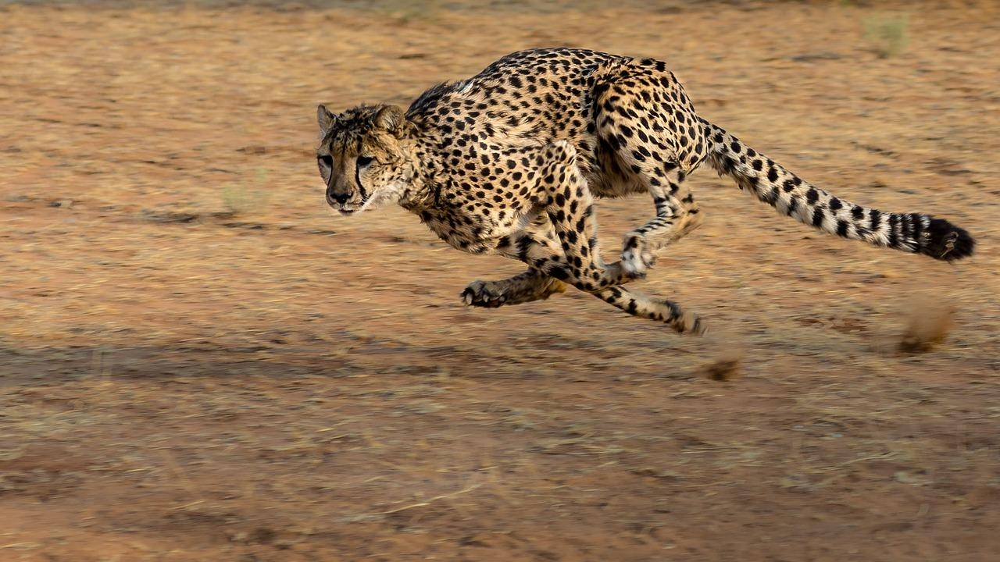

```{r setup, include=FALSE}
knitr::opts_chunk$set(echo = FALSE)
```

# Article analysis 7

## Title of the article 

"India's top court has said cheetahs can be reintroduced in the country, 70 years after they were wiped out"

## Name of the magazine ad source 

BBC, https://www.bbc.com/news/world-asia-india-51279206

## Vocabulary 

|                      |                                |
| ------------------- | ------------------------------ |
| Plea   | Defence                 |
| To roam                   | To migrate         |
| Sheep   | Ruminant mammals  |
| Goat herders  | it is a person who raise sheep  |
| Decade  | A period of 10 years  |
| Doubts  | Hesitation  |
| Haste  | Rush  |
| Prey  | An animal taken by a predator as food  | 

## Analysis table 

|                              |                                                                     |
| ---------------------------- | ------------------------------------------------------------------- |
| Researchers                  | There aren’t researchers but into the article, there only talkes about India's Supreme Court                       |
| Published in?                | Jan 28, 2020                                                       |
| General topic?               | The article talk about the reintroduction of the cheetahs and the and the potential consequences. |
| Procedure/what was examined? | In India, the Supreme Court approved the reintroduction of africian cheetahs in an appropriate location. Cheetahs is endangered species. There are only 7100 africian cheetahs and 50 asian cheetahs left in the wild. The Supreme Court wants that the reintroduction must be « an experience » to know if the animal adapts well to Indian conditions. The disappearance of the cheetah is mainly due to hunting by the goat herders . However, there are 2 opposing opinions for the reintroduction of this animal. Jairam Ramesh, an Indian economist and politician, agrees with the decision and says that there is a lot of argument in favour of the project. As far as environmental defenders are concerned, they believe that the reintroduction of the animal puts it in semi-captive conditions in large, secure zoos. Also, they say that without habitat restoration, reintroduction of prey and taking into account the conflict with Man, the project is not viable. They then demonstrated this with the failure of the reintroduction of the lion in the sanctuary of Chandraprabha in the northern state of Uttar Pradesh in the 1950s   |
| Conclusions/discovery?       |  There are 2 reviews for this project and it has not yet been concluded but conservationists say that not decision will be taken before ckeck that animals will be reintroduced in good conditions.  |
| Remaining questions?         | We don’t know if the reintroduction will be ok. |


