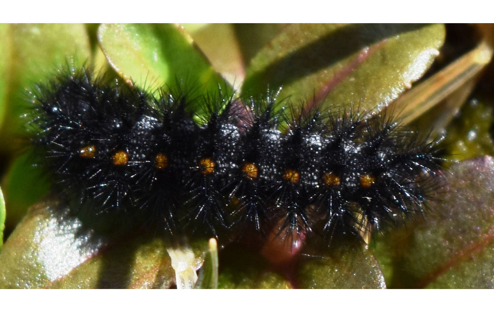

```{r setup, include=FALSE}
knitr::opts_chunk$set(echo = FALSE)
```

## Title of the article 

Endangered butterfly species to be reintroduced to Hornby Island

## Name of the magazine and source 

Victoria News, https://www.vicnews.com/community/endangered-butterfly-species-to-be-reintroduced-to-hornby-island/

## Vocabulary

|                 |                    |
| --------------- | -------------------|
| Caterpillar     | It's the larvae of butterflies |
| To fear          | To be afraid   |
| Threat   | Danger   |
| Trampling   | To step heavily on something or someone  |
| Meadow   | Pasture   |
| Trail   | Footpath   |
| Rope   | Cord   |
| Limbing   | To cut branches of a tree  |
| Weeding    | To remove undesirable or troublesome plant  |
| Seeds    | Germs   |
| Ongoing   | Continuing   |
| Coastal   | Near the coast   |

## Analysis table 

|                   |                        |
| ----------------- | ---------------------- |
| Researchers       | There are no specific researchers. They are biologists.                   |
| Published in?     | Feb 27, 2020           |
| General topic?    | The topic is about the reintroduction of a species of butterflies in a place where they had disappeared                       |
| Procedure/what was examined?   | Hornby Island Helliwell Provincial Park will host an endangered butterfly species. Individuals from the Vancouver Zoo. Butterflies are on the federally listed endangered  and haven’t been seen on this island for 20 years. Biologists thought they had completely disappeared but 2 populations were discovered on 2 islands. The greatest threats to these butterflies is the trampling of caterpillars and their food : plants. This reintroduction took a lot of effort and time from many people. For example, restoring grasslands, weeding grasses and installing new plants. This was also done by volunteers such as schoolchildren. However, even if butterfly monitoring continues to be done everywhere, it is not sure thaht there will be enough funding to continue the program.   |
| Conclusions/discovery?      | Many means are implemented in order to save the species         |
| Remaining questions?        | The project is on the right voice but it is not yet totally sure that the final objective will be realized: a stable population on the island of Hornby              |



